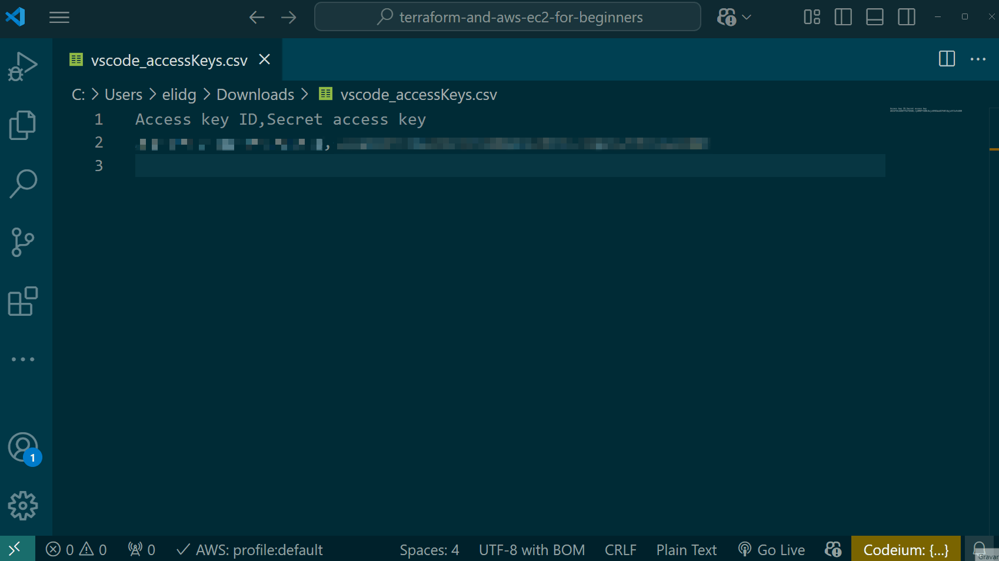
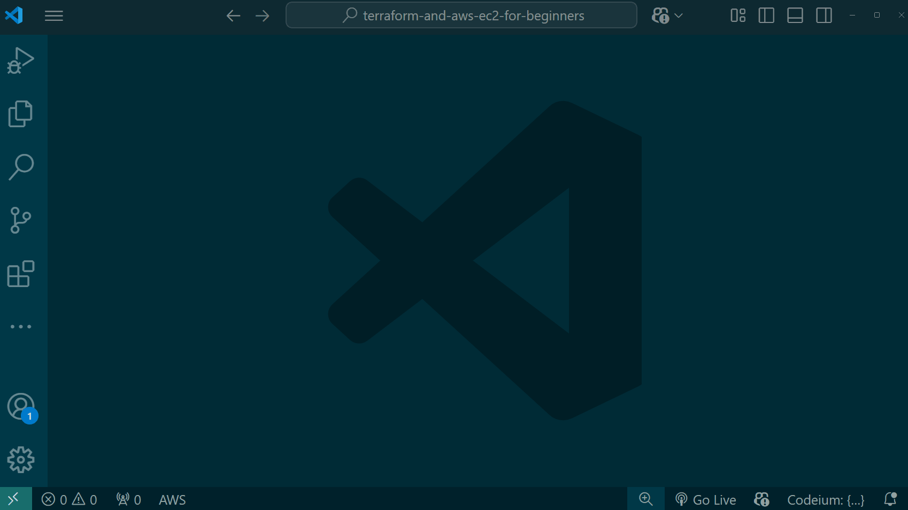
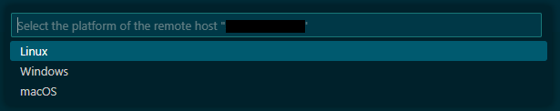
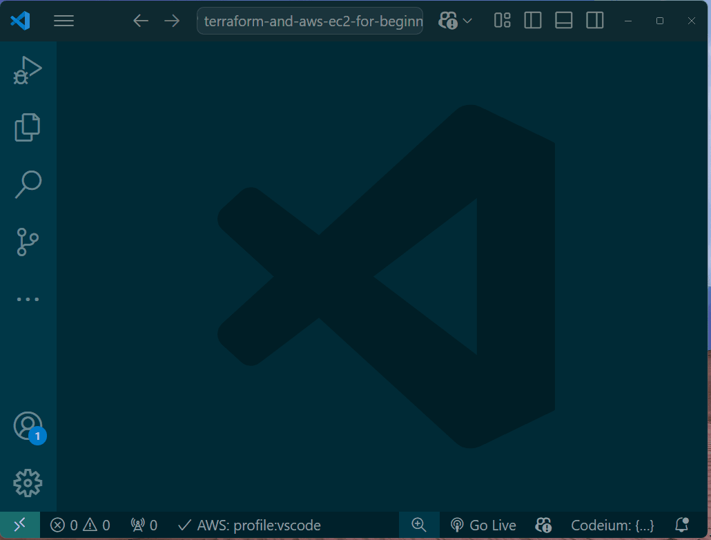
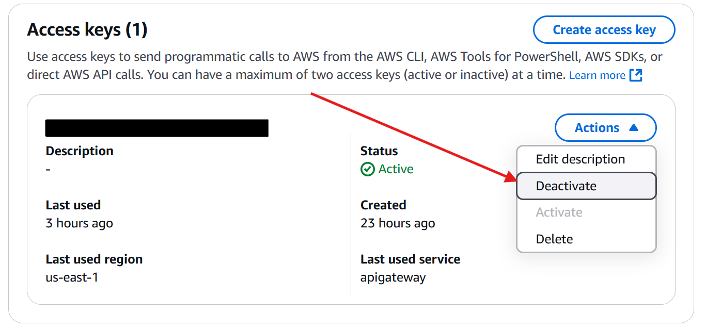

# 👨‍🎓📖 terraform-and-aws-ec2-for-beginners

This repository is based on the [freeCodeCamp.org Youtube course](https://www.youtube.com/watch?v=iRaai1IBlB0) by [Derek Morgan](https://www.linkedin.com/in/derekm1215/).

[](https://www.youtube.com/watch?v=iRaai1IBlB0)

## 🚀 Getting Started

### ⚙️ Installation

[Install Terraform](https://developer.hashicorp.com/terraform/install?product_intent=terraform)

[Install AWS CLI](https://docs.aws.amazon.com/cli/latest/userguide/getting-started-install.html)

[Install VSCode](https://code.visualstudio.com/download)
- Install the [AWS Toolkit extension](https://marketplace.visualstudio.com/items?itemName=AmazonWebServices.aws-toolkit-vscode)
- Install the [Terraform extension](https://marketplace.visualstudio.com/items?itemName=4ops.terraform)

Clone the repository

```
git clone https://github.com/elidaniel92/terraform-and-aws-ec2-for-beginners.git
```

Switch to the repo folder

```
cd terraform-and-aws-ec2-for-beginners
```

### 🔑 Setting AWS Credentials

### Create a user

Create a user in Identity and Access Management (IAM) with the AdministratorAccess permission policy. Generate AWS Access Key ID and Secret Access Key for the user.

> 🚨 **Danger**:  do not share your 🔑 access key! Deactivate your access key after finish the tutorial.


### Create the Credentials Profile 

Add the AWS Access Key ID and Secret Access Key to the `~/.aws/credentials` file with the AWS Toolkit extension.



### Test the connection

Test the credentials. After the connection, it is possible to explore the [AWS Toolkit features.](https://marketplace.visualstudio.com/items?itemName=AmazonWebServices.aws-toolkit-vscode)



### 🏭 Build infrastructure

In the [providers.tf file](providers.tf) configure the AWS region of the infrastructure.

```terraform
provider "aws" {
  region                   = "us-east-1"
  shared_credentials_files = ["~/.aws/credentials"]
  profile                  = "vscode"
}
```

Initialize the directory
```
terraform init 
```

Format and validate the configuration
```
terraform fmt
```

> 💡 Tip: Before executing `terraform apply`, try running `terraform plan` to preview the changes required for your infrastructure.
```
terraform plan 
```

Create infrastructure

Need to respond with the confirmation prompt with a yes.
```
terraform apply
```

> 💡 Tip: Use `--auto-approve` to avoid confirmation prompt.
```
terraform apply --auto-approve
```

### 🌐 EC2 SSH Connection

Do a SSH connection to the EC2 instance with VSCode.

In the first time, it is necessary to choose the OS type. Select the `Linux` option.





### 🔄 Update EC2 Instance

The EC2 instance will be replaced. It is possible to change any of the parameters in the AWS EC2. For example, you can change the OS type.

```
terraform apply -replace aws_instance.dev_node
```

### 💻 Console

Open Terraform Console
```
terraform console
```

Print variable
```
> var.host_os
```

Print AWS Instance Public IP
```
> aws_instance.dev_node.public_ip
```

Terraform Console output sample
```
> var.host_os
"windows"
> aws_instance.dev_node.public_ip
"45.213.150.21"
>
```

### 🔢 Variables

Names, Types and Default values: [see variables definition file (variables.tf)](variables.tf)

Variable values: [see variable values file (terraform.tfvars)](terraform.tfvars)

#### Custom Variables

As a argument in command-line. 
```
terraform console -var="host_os=unix"
```

From a file: [see the custom value variables file (dev.tfvars)](dev.tfvars).
```
terraform console -var-file="dev.tfvars"
```

Test in Terraform Console
```
> var.host_os
```

### 🖨️ Output

The EC2 **public_ip** and **state** will be printed.
```
terraform output
```

#### Change output

You can change the [file outputs.tf](outputs.tf)

Apply refresh only
```
terraform apply -refresh-only
```
Test the output change
```
terraform output
```

### 🗑️ Destroy infrastructure

Destroy all infrastructure resources **created by Terraform**. Any others changes will not be undone, for example the [ssh configuration](ssh-config/).

Need to respond to the confirmation prompt with a yes.
```
terraform destroy
```

> 💡 Tip: Use `--auto-approve` to avoid confirmation prompt.
```
terraform destroy --auto-approve
```

### 🛡️ Security

#### 🌐 Restrict SSH traffic to specific IP ranges     

```terraform
  # Allow SSH traffic
  ingress {
    from_port   = 22
    to_port     = 22
    protocol    = "tcp"
    cidr_blocks = [var.host_public_ip] # Change to restrict IPs for security (IPV4)
    #ipv6_cidr_blocks  = [var.host_public_ip] # Change to restrict IPs for security (IPV6)
  }
```

> ⚠️ Note: Allowing unrestricted ingress (0.0.0.0/0) is insecure and exposes resources to potential attacks. It is typically used for testing or specific use cases but should be restricted in production environments.

#### 🔑 Deactivate Access Key


